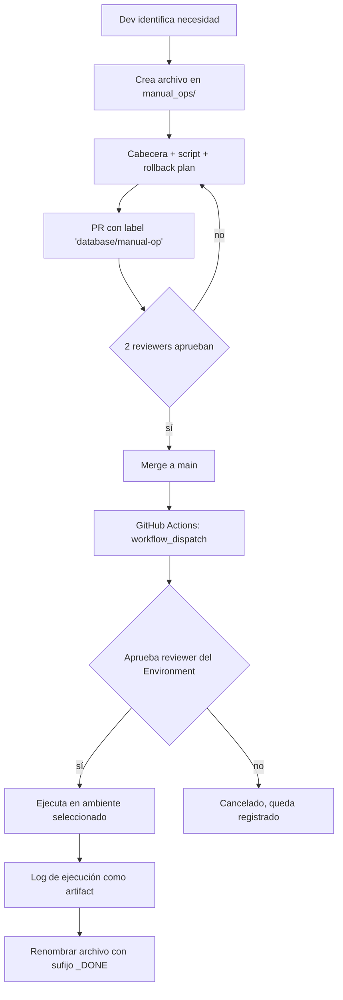

# `manual_ops/` — Operaciones manuales con gate humano

Scripts SQL para operaciones **sensibles** que NO se ejecutan automáticamente y requieren
aprobación humana explícita.

## ⚠️ Cuándo usar este directorio

| Caso de uso | Ejemplo |
|---|---|
| **Backfill de datos** | Poblar una columna nueva con datos derivados de columnas existentes |
| **Limpieza de datos** | Eliminar marcas huérfanas, normalizar formatos |
| **Fix de incidente** | Corregir registros mal capturados por un bug ya solucionado |
| **Cambios destructivos** | `DROP COLUMN`, `DROP TABLE`, `TRUNCATE` |
| **UPDATEs masivos** | Cambiar el valor de un campo en muchas filas |
| **Reindex en producción** | `REINDEX TABLE` que pueda bloquear lecturas |
| **Análisis pesado one-off** | `VACUUM FULL`, `ANALYZE` masivos |

## ❌ Cuándo NO usar este directorio

- Cambios de schema → `migrations/` (Alembic)
- Vistas idempotentes → `views/`
- Catálogos → `seeds/`
- Experimentos del dev → `explore/`

## Reglas estrictas

1. **Nombre del archivo:** `YYYY-MM-DD_descripcion_breve.sql`
   Ejemplo: `2026-06-09_backfill_geofence_puestos.sql`
2. **Cabecera obligatoria** con:
   - Autor y fecha
   - Ticket / issue asociado
   - Justificación
   - Plan de rollback
   - Riesgo estimado y filas afectadas estimadas
3. **Transaccional:** envolver en `BEGIN; ... COMMIT;` salvo cuando no aplica (ej. `VACUUM`, `REINDEX CONCURRENTLY`).
4. **Sin secretos** ni datos personales hardcoded.
5. **PR + 2 aprobaciones** mínimo antes de mergear.
6. **Ejecución manual:** GitHub Actions → workflow `database-manual-ops` → "Run workflow".
7. **Después de ejecutado:** el archivo permanece en este directorio como auditoría histórica.
   NO se borra. Considera renombrar a `2026-06-09_backfill_geofence_puestos_DONE.sql`
   o moverlo a un subdirectorio `_executed/` si crece mucho.

## Template

Ver `_template_manual_op.sql.example` en este directorio.

## Flujo completo



## Cómo se ejecuta

1. Ir a **GitHub → Actions → `database-manual-ops`**.
2. Click en **"Run workflow"**.
3. Inputs:
   - `script_name`: nombre del archivo (sin path), ej: `2026-06-09_backfill_geofence.sql`
   - `environment`: `staging` o `production`
   - `dry_run`: `true` para hacer EXPLAIN sin commitear, `false` para ejecutar real
4. El workflow corre **EXPLAIN primero**, muestra el plan, espera aprobación del Environment.
5. Una vez aprobado, ejecuta y guarda el output como artifact con timestamp.

## Ejemplo de cabecera obligatoria

```sql
-- ============================================================
-- Operación manual: backfill_geofence_puestos
-- ============================================================
-- Autor:       Juan Pérez (@juanp)
-- Fecha:       2026-06-09
-- Ticket:      SCS-142
-- Ambiente:    staging primero, luego production
--
-- Justificación:
--   La columna `geofence_radio_m` fue agregada en migración 015 con NULL.
--   Necesitamos popular los 248 puestos existentes con el valor default 100m.
--
-- Filas afectadas estimadas: ~248
-- Tiempo estimado:           <1 segundo
-- Riesgo:                    Bajo (solo UPDATE de columna nueva)
--
-- Plan de rollback:
--   UPDATE puestos SET geofence_radio_m = NULL WHERE updated_at > '2026-06-09';
--
-- Validación post-ejecución:
--   SELECT COUNT(*) FROM puestos WHERE geofence_radio_m IS NULL;
--   Resultado esperado: 0
-- ============================================================

BEGIN;

UPDATE puestos
SET geofence_radio_m = 100,
    updated_at = NOW()
WHERE geofence_radio_m IS NULL;

-- Validación interna antes del commit
DO $$
DECLARE
    pendientes int;
BEGIN
    SELECT COUNT(*) INTO pendientes FROM puestos WHERE geofence_radio_m IS NULL;
    IF pendientes > 0 THEN
        RAISE EXCEPTION 'Quedan % puestos sin geofence, abortando', pendientes;
    END IF;
END $$;

COMMIT;
```
